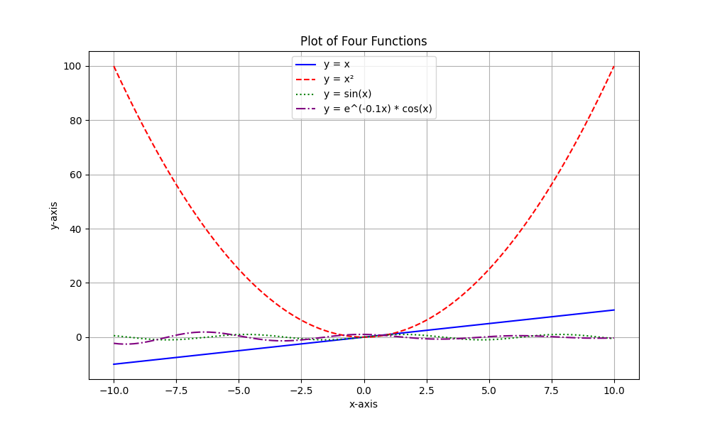
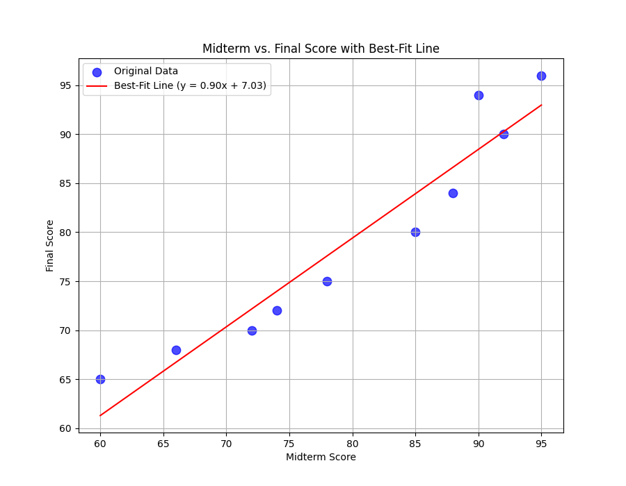

# math-visualization-assignment

## Project Description
This project focuses on visualizing mathematical functions and analyzing student performance data using Python. It demonstrates how to plot standard mathematical equations, create custom functions, and perform exploratory data analysis (EDA) on a dataset of student scores. The project also includes a simple linear regression model to predict final exam scores based on midterm results.

## Libraries Used
- **NumPy**: Used for numerical computations, array handling, and mathematical function generation.
- **Matplotlib**: Used for creating a variety of static visualizations including line plots, scatter plots, histograms, and bar charts.
- **Pandas**: Used for data manipulation and storage in a DataFrame format.

## How to Run the Code
1. Ensure you have Python installed on your system.
2. Install the necessary libraries using pip:
   ```bash
   pip install numpy matplotlib pandas
   ```
3. Open the provided Jupyter Notebook file: `math_visualization.ipynb`.
4. Run the cells sequentially to see the mathematical plots and data analysis results.

## Screenshots of Generated Graphs

### 1. Mathematical Function Visualization
This plot displays multiple mathematical functions including linear, quadratic, trigonometric, and exponential functions on a single coordinate plane.


### 2. Midterm vs. Final Score with Best-Fit Line
This scatter plot with a regression line illustrates the correlation between midterm and final scores, allowing for performance prediction.


## Short Explanation

### How does visualization help us understand mathematical functions and data?
Visualization translates abstract numbers and equations into visual shapes and patterns. This makes it easier to perceive the growth rate of functions, identify periodicity, and spot correlations or anomalies in data. Instead of analyzing a list of scores, a graph immediately reveals the overall class performance and individual standing.

### Which plot was most useful in this assignment and why?
The **Midterm vs. Final Score with Best-Fit Line** was the most useful. It effectively combined data representation with predictive modeling. By looking at the best-fit line, we can quantify the relationship between the two exams and make informed estimates for student outcomes, which is highly practical for educational analysis.

### What is the role of NumPy and Matplotlib in your project?
- **NumPy** provided the mathematical engine, allowing for the generation of coordinate ranges and the calculation of regression coefficients (slope and intercept) through its efficient array operations.
- **Matplotlib** acted as the visual interface, providing the functions necessary to render data points, style lines, add labels, and save the final outputs as image files.
